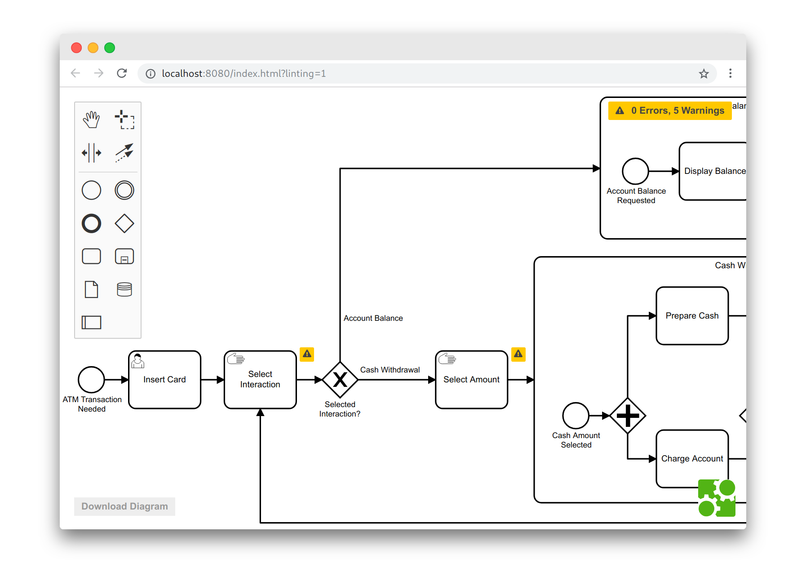

# bpmnlint-playground

[](https://github.com/bpmn-io/bpmnlint-playground/actions/workflows/CI.yml)

A playground to try out [bpmnlint](https://github.com/bpmn-io/bpmnlint) diagram validation and implement and new rules.




## Run the Playground

Open the playground in your browser

```
npx bpmnlint-playground
```

It will watch your local `.bpmnlintrc` as well as the `./rules` folder for changes and refresh the browser window accordingly.


## Features

#### App

* Validate your diagrams
* Drop diagrams into the page to open them and trigger validation
* Apply changes and download the diagram

#### Rules

* Configure checked lint/validation rules via the [`.bpmnlintrc`](.bpmnlintrc) file
* Create or modify rules in the [`./plugin/rules`](./plugin/rules) directory
* Expose default configurations using the [plugin entry point](./plugin/index.js)
* See how rule changes are reflected in the app in real time


## Resources

* [bpmnlint](https://github.com/bpmn-io/bpmnlint)
* [bpmnlint-plugin-example](https://github.com/bpmn-io/bpmnlint-plugin-example)
* [bpmn-js-bpmnlint](https://github.com/bpmn-io/bpmn-js-bpmnlint)


## License

MIT
